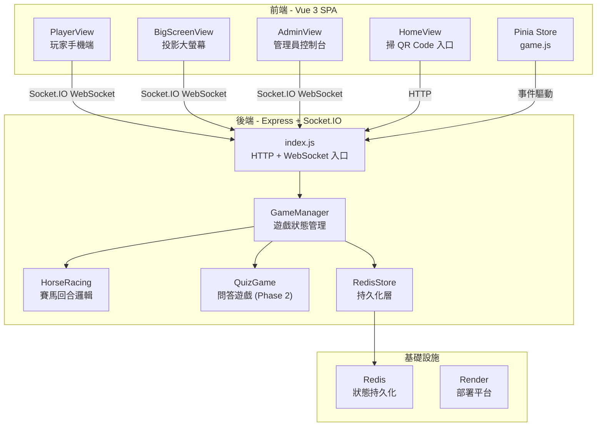
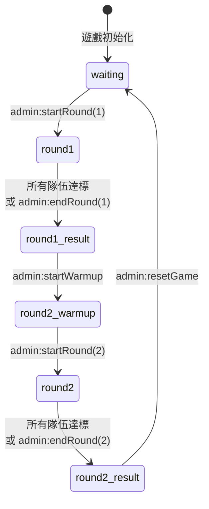
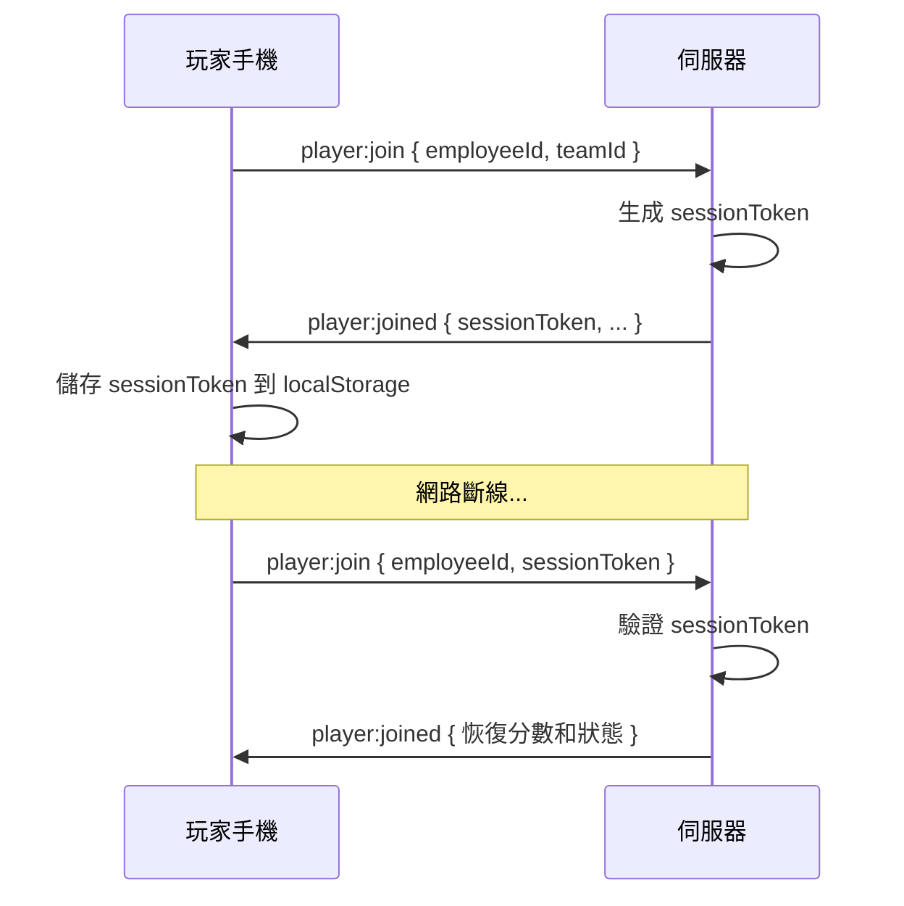

# 🏇 Spring Gala Game - 系統架構文件

> 春酒互動遊戲：600 位玩家分 3 組進行即時賽馬競賽

---

## 一、專案概覽

此專案為大型公司春酒活動的即時互動遊戲，支援約 **600 位玩家**同時在線，透過手機參與賽馬比賽。玩家分為 3 個隊伍（藍、黃、紅），透過 QR Code 掃描加入遊戲，在大螢幕上觀看即時賽馬進度。

### 核心玩法

| 回合 | 操作方式 | 計分 | Bonus 機制 |
|------|----------|------|------------|
| **Round 1** | 手機點擊按鈕 | 正常 1 分 / Bonus 2 分 | 按鈕位移增加難度 |
| **Round 2** | 手機搖晃（陀螺儀） | 正常 1 分 / Bonus 2 分 | 達門檻後進入 Bonus |

---

## 二、技術架構



### 技術棧

| 層級 | 技術 | 版本 |
|------|------|------|
| **前端框架** | Vue 3 (Composition API) | ^3.x |
| **狀態管理** | Pinia | ^2.x |
| **路由** | Vue Router | ^4.x |
| **即時通訊** | Socket.IO Client | ^4.7 |
| **動畫** | GSAP + CSS Animations | — |
| **後端框架** | Express | ^4.18 |
| **WebSocket** | Socket.IO Server | ^4.7 |
| **持久化** | Redis | ^4.6 |
| **部署** | Render (Node.js) | — |

---

## 三、目錄結構

```
spring-gala-game/
├── package.json              # 根 package，含 concurrently 啟動腳本
├── render.yaml               # Render 部署配置
├── client/                   # 前端 Vue 3 SPA
│   └── src/
│       ├── main.js           # Vue 應用入口
│       ├── App.vue           # 根元件
│       ├── router/
│       │   └── index.js      # 路由定義（4 個頁面）
│       ├── stores/
│       │   └── game.js       # Pinia Store（WebSocket + 遊戲狀態）
│       ├── styles/
│       │   └── main.css      # 全域樣式
│       ├── utils/
│       │   └── animations.js # GSAP 動畫工具
│       ├── components/
│       │   └── HorseRaceAnimation.vue
│       └── views/
│           ├── HomeView.vue       # 首頁 + QR Code 入口
│           ├── PlayerView.vue     # 玩家遊戲介面
│           ├── BigScreenView.vue  # 大螢幕投影
│           └── AdminView.vue      # 管理員控制台
├── server/                   # 後端 Node.js
│   ├── index.js              # Express + Socket.IO 入口
│   └── game/
│       ├── GameManager.js    # 核心遊戲管理器
│       ├── HorseRacing.js    # 賽馬回合邏輯
│       ├── QuizGame.js       # 問答遊戲邏輯 (Phase 2)
│       └── RedisStore.js     # Redis 持久化層
└── tests/                    # 測試（Artillery 負載測試）
```

---

## 四、前端路由

| 路徑 | 元件 | 用途 |
|------|------|------|
| `/` | `HomeView` | 首頁，顯示 QR Code 引導玩家加入 |
| `/player` | `PlayerView` | 玩家手機端，支援點擊/搖晃操作 |
| `/screen` | `BigScreenView` | 投影用大螢幕，顯示賽馬進度和排行榜 |
| `/admin` | `AdminView` | 管理員控制台，控制遊戲流程 |

---

## 五、遊戲狀態機



### 遊戲階段說明

| 階段 | gamePhase | 說明 |
|------|-----------|------|
| 等待中 | `waiting` | 玩家透過 QR Code 加入，等待管理員開始 |
| Round 1 | `round1` | 玩家點擊按鈕得分，大螢幕顯示賽馬 |
| Round 1 結果 | `round1_result` | 顯示 Round 1 排行榜 |
| Round 2 暖身 | `round2_warmup` | 玩家授權手機感測器權限 |
| Round 2 | `round2` | 玩家搖晃手機得分（陀螺儀感測） |
| 最終結果 | `round2_result` | 顯示最終排行榜和頒獎台 |

---

## 六、後端核心模組

### 6.1 `server/index.js` — 伺服器入口

- 建立 Express HTTP 伺服器和 Socket.IO WebSocket 伺服器
- 配置 CORS（開發: localhost:5173 / 正式: Render URL）
- 定義 REST API 端點（`/api/health`、`/api/game/status`）
- 註冊所有 Socket.IO 事件處理器
- 正式環境提供 SPA 靜態檔案

### 6.2 `GameManager.js` — 遊戲管理器（核心）

**職責**：管理所有遊戲狀態、玩家、隊伍、設定

```javascript
// 核心資料結構
this.players    // Map<socketId, playerData> — 所有玩家
this.teams      // Map<teamId, teamData>     — 3 個隊伍
this.settings   // Object                    — 遊戲設定
this.gameState  // Object                    — 當前遊戲狀態
```

**關鍵方法**：

| 方法 | 說明 |
|------|------|
| `addPlayer(socket, data)` | 玩家加入（含重連邏輯 + Session Token 驗證） |
| `reconnectPlayer(socket, employeeId, token)` | Session Token 驗證重連 |
| `startGame(round)` | 開始指定回合 |
| `endRound(round)` | 強制結束當前回合 |
| `startWarmup()` | 進入 Round 2 暖身階段 |
| `showLeaderboard(type)` | 顯示排行榜 |
| `resetGame()` | 重置遊戲（新場次） |
| `updateSettings(newSettings)` | 更新遊戲設定 |

**預設設定值**：

```javascript
{
  round1TargetScore: 40000,    // Round 1 目標分數
  round2TargetScore: 25000,    // Round 2 目標分數
  round1BonusThreshold1: 20000,// Round 1 第一階 Bonus 門檻
  round1BonusThreshold2: 30000,// Round 1 第二階 Bonus 門檻
  round2BonusThreshold: 15000, // Round 2 Bonus 門檻
  gyroThreshold: 2.0,          // 搖晃門檻 (rad/s)
  accelThreshold: 15           // 加速度門檻 (m/s²)
}
```

### 6.3 `HorseRacing.js` — 賽馬回合邏輯

**職責**：處理 Round 1（點擊）和 Round 2（搖晃）的計分與狀態更新

**核心流程**：

1. `start(round)` → 重置分數，啟動 200ms 定時更新
2. 定時器每 200ms 執行：
   - `broadcastUpdate()` → 廣播賽道進度到大螢幕
   - `checkBonusThresholds()` → 檢查是否進入 Bonus 階段
   - `checkRoundEnd()` → 檢查是否所有隊伍達標
3. `handleAction(socketId, data)` → 處理玩家動作，更新個人/隊伍分數
4. `endRound()` → 停止定時器、計算排名、廣播結果

**計分邏輯**：

| 回合 | 正常 | Bonus | 感測器 |
|------|------|-------|--------|
| Round 1 | 1 分/點擊 | 2 分/點擊 | — |
| Round 2 | 1 分/搖晃 | 2 分/搖晃 | Gyroscope.z > threshold |

**Bonus 機制**：
- Round 1：任一隊伍分數達門檻 → 按鈕位移增加難度
- Round 2：任一隊伍分數達門檻 → 分數加倍

**分數上限**：當隊伍總分達到目標分數，停止累積（`handleAction` 中檢查）

### 6.4 `QuizGame.js` — 問答遊戲（Phase 2，待實裝）

問答積分賽的框架，包含出題、答題、計分邏輯。目前有基礎實作但尚未與前端整合。

### 6.5 `RedisStore.js` — 持久化層

提供遊戲狀態的 Redis 持久化，用於伺服器重啟恢復。

| 方法 | 說明 |
|------|------|
| `saveGameState / loadGameState` | 遊戲狀態 |
| `savePlayer / loadPlayers` | 玩家資料 |
| `saveTeams / loadTeams` | 隊伍資料 |
| `saveSettings / loadSettings` | 遊戲設定 |
| `clearAll` | 重置時清除所有資料 |

> ⚠️ Redis 連接失敗時會自動降級為記憶體模式運行

---

## 七、Socket.IO 事件清單

### Client → Server（上行事件）

| 事件 | 發送者 | 資料 | 說明 |
|------|--------|------|------|
| `player:join` | 玩家 | `{ employeeId, teamId, sessionToken? }` | 加入遊戲 |
| `player:action` | 玩家 | `{ type: 'tap'\|'shake', gyroZ?, accelY? }` | 玩家動作 |
| `screen:join` | 大螢幕 | — | 大螢幕註冊 |
| `admin:join` | 管理員 | — | 管理員註冊 |
| `admin:startRound` | 管理員 | `{ round: 1\|2 }` | 開始回合 |
| `admin:startWarmup` | 管理員 | — | 開始 Round 2 暖身 |
| `admin:endRound` | 管理員 | `{ round: 1\|2 }` | 強制結束回合 |
| `admin:updateSettings` | 管理員 | `{ ...settings }` | 更新設定 |
| `admin:showLeaderboard` | 管理員 | `{ type: 'total' }` | 顯示排行榜 |
| `admin:resetGame` | 管理員 | — | 重置遊戲 |

### Server → Client（下行事件）

| 事件 | 接收者 | 資料 | 說明 |
|------|--------|------|------|
| `player:joined` | 玩家 | `{ player, team, gameState, settings }` | 加入成功 |
| `player:score` | 玩家 | `{ score, totalScore, increment }` | 即時分數更新 |
| `game:start` | 全體 | `{ phase, round }` | 遊戲開始 |
| `game:stop` | 全體 | — | 遊戲停止 |
| `bonus:change` | 全體 | `{ bonusStage, buttonPosition, motionType }` | Bonus 狀態變更 |
| `race:update` | 大螢幕 | `{ horses, round, bonusStage, targetScore }` | 賽道進度更新 |
| `round1:end` / `round2:end` | 全體 | `{ teams, leaderboard, winner }` | 回合結束 |
| `leaderboard:show` | 全體 | `{ leaderboard, teams }` | 排行榜資料 |
| `screen:init` | 大螢幕 | `{ settings, teams, gameState }` | 大螢幕初始化 |
| `settings:update` | 大螢幕/管理員 | `{ ...settings }` | 設定同步 |
| `playerCount` | 全體 | `{ count, teams: [...] }` | 人數更新 |

### Socket Rooms

| Room | 加入方式 | 用途 |
|------|----------|------|
| `team:{teamId}` | `player:join` | 隊伍廣播 |
| `screens` | `screen:join` | 大螢幕廣播 |
| `admins` | `admin:join` | 管理員廣播 |

---

## 八、玩家身份驗證與重連



- **Session Token**：32 位隨機字串，首次加入時生成
- **儲存位置**：玩家端 `localStorage`（key: `spring-gala-session`）
- **重連邏輯**：`GameManager.reconnectPlayer()` 驗證 token 並恢復狀態

---

## 九、前端狀態管理 (`game.js`)

Pinia store 使用 Composition API 風格，管理所有 Socket.IO 連線和遊戲狀態。

**核心響應式狀態**：

```javascript
// 玩家資料
player, team, score, totalScore

// 遊戲狀態
gamePhase, isRunning, currentRound, settings

// Bonus 狀態
bonusStage, buttonPosition, motionType

// 隊伍與排行
teams, playerCount, leaderboard
```

**Socket 事件處理**：所有 Socket.IO 下行事件在 `connect()` 方法中註冊監聽器，自動更新響應式狀態。

---

## 十、開發環境

### 啟動開發伺服器

```bash
# 安裝依賴
npm run install:all

# 同時啟動前後端
npm run dev
# 或分別啟動：
cd server && npm run dev   # port 3000
cd client && npm run dev   # port 5173
```

### 環境變數

| 變數 | 預設值 | 說明 |
|------|--------|------|
| `PORT` | `3000` | 伺服器埠號 |
| `NODE_ENV` | `development` | 環境模式 |
| `REDIS_URL` | `redis://localhost:6379` | Redis 連線 URL |
| `RENDER_EXTERNAL_URL` | — | Render 正式環境 URL |
| `CORS_ORIGIN` | — | 自訂 CORS 允許來源 |

### 部署

使用 Render 平台，配置檔為 `render.yaml`：
- **Build**：`cd client && npm install && npm run build && cd ../server && npm install`
- **Start**：`cd server && npm start`
- 正式環境 Express 會提供 `client/dist/` 靜態檔案

---

## 十一、資料流概覽

### Round 1 點擊流程

```
玩家點擊按鈕
  → PlayerView.handleTap()
  → gameStore.sendTap()
  → socket.emit('player:action', { type: 'tap' })
  → GameManager.handlePlayerAction()
  → HorseRacing.handleAction()
  → 更新 player 和 team 分數
  → socket.emit('player:score', { score, totalScore })  ← 回傳給玩家
  → 每 200ms broadcastUpdate()
  → io.to('screens').emit('race:update', { horses })    ← 更新大螢幕
```

### Round 2 搖晃流程

```
玩家搖晃手機
  → DeviceOrientationEvent 監聽
  → gameStore.sendShake(gyroZ, accelY)
  → socket.emit('player:action', { type: 'shake', gyroZ, accelY })
  → HorseRacing.handleAction()
  → 判斷 |gyroZ| > gyroThreshold
  → 更新分數（同上）
```

---

## 十二、已知限制與注意事項

> [!WARNING]
> Redis 連接在 Render 上可能失敗，遊戲會自動降級為記憶體模式，伺服器重啟後資料會遺失。

> [!IMPORTANT]
> iOS Safari 需要使用者主動點擊按鈕授權 DeviceOrientation 感測器權限，因此 Round 2 之前有 warmup 階段。

> [!NOTE]
> QuizGame（Phase 2 伯樂與千里馬問答）已有後端框架但前端尚未整合，目前先不使用。
